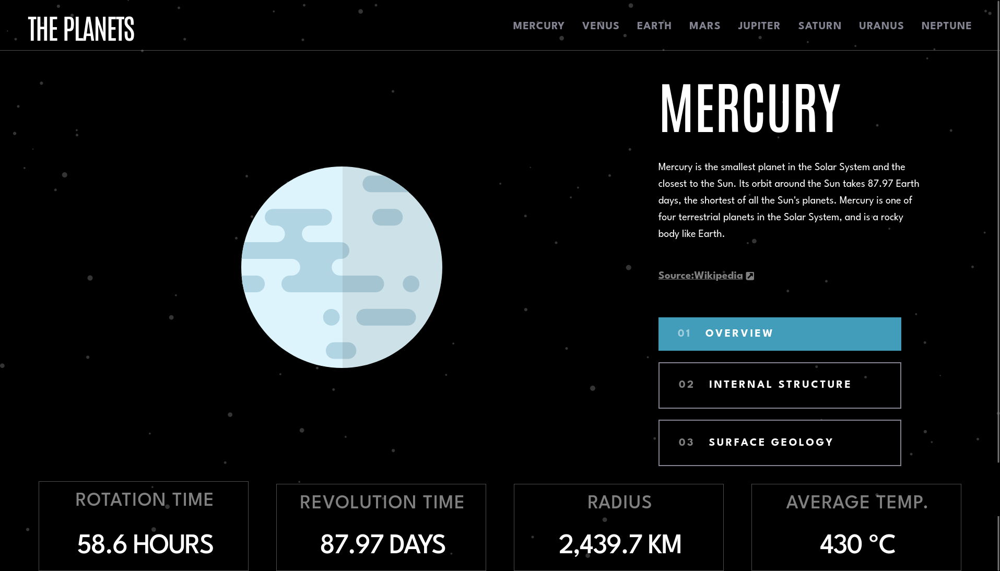

# Frontend Mentor - Planets fact site solution

This is a solution to the [Planets fact site challenge on Frontend Mentor](https://www.frontendmentor.io/challenges/planets-fact-site-gazqN8w_f). Frontend Mentor challenges help you improve your coding skills by building realistic projects.

## Table of contents

- [Overview](#overview)
  - [The challenge](#the-challenge)
  - [Screenshot](#screenshot)
  - [Links](#links)
- [My process](#my-process)
  - [Built with](#built-with)
  - [What I learned](#what-i-learned)
  - [Continued development](#continued-development)
  - [Useful resources](#useful-resources)
- [Author](#author)
- [Acknowledgments](#acknowledgments)

## Overview

### The challenge

Users should be able to:

- View the optimal layout for the app depending on their device's screen size
- See hover states for all interactive elements on the page
- View each planet page and toggle between "Overview", "Internal Structure", and "Surface Geology"

### Screenshot



### Links

- Solution URL: [Add solution URL here](https://github.com/ttsoares/planets)
- Live Site URL: [Add live site URL here](https://planets-zeta.vercel.app/)

## My process

### Built with

- Semantic HTML5 markup
- Tailwind custom properties
- [React](https://reactjs.org/) - JS library
- [Next.js](https://nextjs.org/) - React framework
- [tailwindCSS](https://tailwindcss.com/) - For styles
- [Zustand](https://www.npmjs.com/package/zustand) - A small, fast and scalable bearbones state-management solution using simplified flux principles.

### What I learned

The application of the state management Zustand in a very simple context.

```js
import { create } from "zustand";

const usePlanets = create((set) => ({
  planet: 0,
  choose: (index) => set(() => ({ planet: index })),
}));

export default usePlanets;
```

### Continued development

There is a lot more to explore in the Zustand context.

### Useful resources

- [Zustand/NextJS](https://www.youtube.com/watch?v=mu05SwL6l1o) - "State Management using Zustand In Nextjs 13.4 and React"

## Author

- Website - [Thomas Tschoepke Soares](https://www.linkedin.com/in/thomas-soares-6791781b/)
- Frontend Mentor - [@ttsoares](https://www.frontendmentor.io/profile/ttsoares)

## Acknowledgments

- [Conditional TW classes](https://www.youtube.com/watch?v=VPpw6_S44J0) - How to apply clxs and tailwind-merge to manage conditional Tailwind classes.
